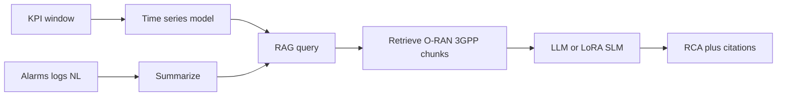

# ClauseGuardRAN

Citation-grounded multimodal root-cause analysis (RCA) for O-RAN troubleshooting: combine KPI time series, alarms/logs, and retrieved O-RAN / 3GPP specification passages into evidence-backed explanations.

Every output is a suggestion for a human to check. **The system never acts on a live network.**

---

## Problem

A support engineer sees an alarm and KPI shift at once — throughput drops, handover counters spike, PRB utilization looks wrong. The explanation is split across two places:

1. **Live measurements** — KPI windows, alarms, logs, natural-language context  
2. **Static specifications** — O-RAN and 3GPP clauses that define what those counters mean and what should happen when they fail  

Confident answers fail for different reasons: the retriever grabbed the wrong clause, or the model ignored the right clause and fell back on pretraining. This project builds a pipeline that surfaces both **fault evidence** and **cited spec passages** so those failure modes are visible.

---

## What this system does

1. Detects fault conditions from **KPI time series** and **textual alarms / logs / NL context**
2. Retrieves supporting passages from a curated **O-RAN / 3GPP** corpus
3. Generates a **root-cause explanation** where claims trace to KPI stats, alarm/log evidence, or cited spec chunks

Experiments compare **KPI-only**, **text-only**, and **KPI + text + RAG**, and whether a **LoRA-adapted small language model** can match a larger general-purpose model when retrieval is held fixed.

### End-to-end pipeline


```mermaid
flowchart LR
  KPI[KPI window] --> TS[Time series model]
  Text[Alarms logs NL] --> Sum[Summarize]
  TS --> Query[RAG query]
  Sum --> Query
  Query --> Ret[Retrieve O-RAN 3GPP chunks]
  Ret --> LLM[LLM or LoRA SLM]
  LLM --> Out[RCA plus citations]
```

**Interfaces:** FastAPI (`/query`, `/rca`, `/evaluate`, `/search`, `/health`) and an MCP server exposing the same core as tools (not a second copy of retrieval logic).

---

## End-of-term deliverables

| # | Must ship |
|---|-----------|
| 1 | Rebuildable 20–40 doc corpus, Qdrant index, `/search` and grounded `/query` |
| 2 | TelecomTS `scenarios.jsonl`, golden eval ≥30 (stretch 50–75), Recall@k / MRR runner |
| 3 | KPI (classical + one deep) and text-only baselines on a held-out split |
| 4 | Sequential RCA + Llama 3.1 8B QLoRA vs general LLM; four-row ablation |
| 5 | FastAPI + MCP (3 tools) + one-page UI + three-scenario demo script + report |

**Primary telemetry:** [TelecomTS](https://huggingface.co/datasets/AliMaatouk/TelecomTS). **Spec grounding:** curated O-RAN / 3GPP PDFs with manifest, version tags, and clause-level chunking.

---

## Current status (scaffold)

This repository is a **scaffold**: package layout, Docker Compose (Qdrant + API), and placeholders for the 12-week pipeline.

| Area | Status |
|------|--------|
| `GET /health` | Implemented (optional Qdrant ping) |
| `POST /search` | Implemented — typed vector search over indexed specification chunks |
| `POST /query` | Grounded answer with retrieved citations; abstains when evidence is empty or insufficient |
| `POST /rca`, `/evaluate` | Stubs (`501` / `not_implemented`) |
| CLI (`parse_corpus`, `index_corpus`, …) | `parse_corpus` and `index_corpus` implemented; other commands remain stubs |
| MCP tools | Stub (lists planned tool names) |
| UI | Deferred (`src/ui/` placeholder only) |
| QLoRA training | Host GPU later — not in Docker |

Do not expect Week 7 RCA behavior until those modules are implemented.

---

## Repository layout

```text
clauseguard-ran/
├── src/clauseguard/
│   ├── corpus/          # manifest, PDF parse, chunking
│   ├── retrieval/       # embeddings, Qdrant, indexer
│   ├── datasets/        # TelecomTS, scenarios, schemas
│   ├── kpi/             # KPI baselines
│   ├── text/            # text-only classifier
│   ├── rca/             # sequential multimodal pipeline (shared core)
│   ├── llm/             # OpenAI + LoRA hooks
│   ├── eval/            # Recall@k, MRR, runners
│   ├── api/             # FastAPI routes
│   ├── mcp/             # MCP server (Week 11)
│   └── cli/             # operational commands
├── data/                # corpus, scenarios, golden (examples tracked)
├── artifacts/           # eval outputs, traces (gitignored contents)
├── models/              # LoRA adapters (gitignored contents)
├── docker-compose.yml
├── Dockerfile
├── Makefile
├── pyproject.toml
└── uv.lock
```

Local planning notes under `.context/` are **gitignored** and not part of the published tree.

---

## Prerequisites

- Python **≥ 3.11**
- **[uv](https://docs.astral.sh/uv/)** (recommended local package manager)
- **Docker Desktop** (or Docker Engine + Compose) for Qdrant + API
- `OPENAI_API_KEY` for corpus embeddings; parsed corpus text is required for indexing
- `NVIDIA_API_KEY` for grounded `/query` generation through NVIDIA NIM

---

## Local setup with uv

This repo already has a `pyproject.toml` and `src/clauseguard` package. After cloning, use **`uv sync`** — do **not** run `uv init` (that scaffolds a *new* project).

```bash
# Install uv once: https://docs.astral.sh/uv/getting-started/installation/

cp .env.example .env
uv sync --extra dev

# Run the API locally
uv run uvicorn clauseguard.api.main:app --reload --port 8000

# In another terminal
curl http://localhost:8000/health
uv run pytest
```

Equivalent via Makefile:

```bash
make install   # uv sync --extra dev
make api       # uv run uvicorn …
make test      # uv run pytest
```

### New project vs this repo

| Situation | Command |
|-----------|---------|
| Starting a brand-new empty project | `uv init` |
| Working in **this** clone | `uv sync --extra dev` then `uv run …` |

---

## Docker setup

Starts Qdrant and the API image (same FastAPI app).

```bash
cp .env.example .env
make up
curl http://localhost:8000/health
make logs    # follow API logs
make down
```

| Service | Ports |
|---------|-------|
| API | `8000` |
| Qdrant | `6333`, `6334` |

Volumes mount `./data`, `./artifacts`, and `./models` (read-only for models). Optional MCP profile: `make mcp` (stub entrypoint).

---

## API surface

| Endpoint | Week | Behavior now |
|----------|------|----------------|
| `GET /health` | 0 | Real liveness (+ optional Qdrant reachability) |
| `POST /search` | 2 | Vector search — embeddings, Qdrant hits, and provenance metadata |
| `POST /query` | 3 | Grounded answer + retrieved citations; returns `not found` when evidence is insufficient |
| `POST /rca` | 7 | Stub — fault + KPI / text / spec evidence |
| `POST /evaluate` | 5 | Stub — golden eval → artifacts |

All non-health routes will eventually call the shared `RcaPipeline` / eval runner rather than duplicating retrieval.

---

## Makefile targets

| Target | Status |
|--------|--------|
| `make install` | Working — `uv sync --extra dev` |
| `make api` | Working — local uvicorn via uv |
| `make test` | Working — `uv run pytest` |
| `make up` / `down` / `logs` | Working — Docker Compose |
| `make parse` | Working — validates and parses acquired PDF/DOCX corpus sources |
| `make index` | Working for parsed text; requires Qdrant and `OPENAI_API_KEY` |
| `make ingest-telecomts` / `eval` / `e2e` | Stubs |
| `make mcp` | Stub MCP profile |

`make parse` validates every acquired manifest row against the source file under
`data/corpus/raw/`, then extracts PDF and DOCX text to `data/corpus/parsed/`. Each parsed file
uses the corresponding manifest filename stem with a `.txt` suffix (for example, `spec.pdf` maps
to `spec.txt`). `make index` consumes those parsed files, batches OpenAI embeddings, and writes
citation-ready points to Qdrant.

After indexing, search the retrieved specification passages through the API:

```bash
curl -X POST http://localhost:8000/search \
  -H 'Content-Type: application/json' \
  -d '{"query":"E2SM-KPM downlink UE throughput counter","top_k":3}'
```

The response contains a `results` list with passage text, relevance score, and the
`spec_id`, `section`, `source_file`, and `chunk_id` provenance fields. A valid query with no
matches returns `{"results":[]}`; blank or whitespace-only queries return `422`.

Ask a question grounded in the retrieved passages with `/query`:

```bash
curl -X POST http://localhost:8000/query \
  -H 'Content-Type: application/json' \
  -d '{"question":"What does the E2 interface connect?","top_k":3}'
```

A successful answer includes citations projected from the retrieved chunks:

```json
{
  "answer": "The E2 interface connects the near-real-time RIC and an E2 node.",
  "citations": [
    {
      "spec_id": "O-RAN.WG3.E2AP-R003-v04.00",
      "section": "5.2.2",
      "source_file": "e2ap.pdf",
      "chunk_id": "e2ap-5-2-2-001"
    }
  ]
}
```

If retrieval is empty, or the selected model judges the retrieved evidence insufficient, the
endpoint returns HTTP 200 with `{"answer":"not found","citations":[]}`. Empty retrieval does
not invoke a model. The model sees only retrieved passages, but semantic entailment is not
independently verified. `/query` uses NVIDIA NIM models in priority order; transient rate limits,
timeouts, and gateway errors can fail over to another configured model. Set `NVIDIA_API_KEY` in
`.env` before starting Docker. Model cooldown state is process-local.

To verify the fallback path without intentionally rate-limiting your NVIDIA account, run
`uv run python scripts/smoke_nvidia_failover.py` with `NVIDIA_API_KEY` configured. The script
simulates a 429 response only for the first model request, then sends the fallback request to
NVIDIA and prints the model used and structured response. This is an opt-in live provider check;
the automated failover tests remain fully mocked.

---

## MCP (planned, Week 11)

Exactly three tools, same pipeline as FastAPI:

- `search_o_ran_specs`
- `run_rca`
- `summarize_kpi_window`

---

## Data and provenance

| Role | Source |
|------|--------|
| KPI + NL + RCA labels | TelecomTS |
| Spec grounding | Curated O-RAN / 3GPP PDFs listed in corpus manifest |
| Shape examples | `data/corpus/manifest.example.csv`, `data/scenarios/scenarios.example.jsonl`, `data/golden/golden_eval.example.jsonl` |

Raw PDFs, parsed text, downloaded TelecomTS, real `scenarios.jsonl` / `golden_eval.jsonl`, and model weights are gitignored; rebuild from scripts and manifests when those exist.

---

## License

MIT — see [LICENSE](LICENSE).
